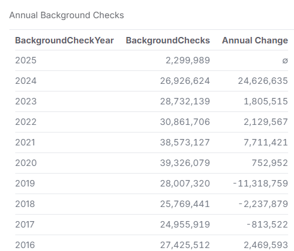
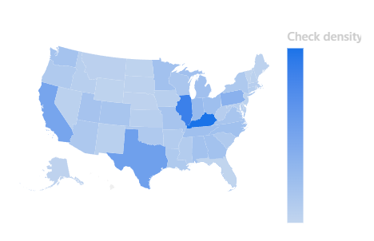

# Gun Registration


## Background
Firearm background checks in the United States are a key regulatory measure used to prevent unauthorized firearm purchases. The National Instant Criminal Background Check System (NICS), maintained by the FBI, processes these checks to ensure that individuals who are legally prohibited from owning firearms do not obtain them. The volume and trends of background checks serve as a proxy for firearm sales and can provide insights into firearm-related policy effectiveness, public safety concerns, and shifts in gun ownership patterns.


## Motivation
This analysis aims to explore trends in firearm background checks across different states and over time. By examining variations in background check volumes, we can identify potential correlations with policy changes, socioeconomic factors, or major events (e.g., elections, crises, mass shootings, legislative changes) that may influence firearm purchases. The insights gained can be valuable for policymakers, law enforcement agencies, and researchers studying gun control effectiveness, public safety, and firearm market trends.


## Repository Structure

- **Data Files:**
  - `firearm_deaths.csv`: Contains data on firearm-related deaths.
  - `nics-firearm-background-checks.csv`: Includes records of firearm background checks.
  - `states.csv`: Provides information on U.S. states, possibly for data merging or reference.

- **Malloy Files:**
  - `backgroundsource.malloy`: Defines the data models and relationships for analysis.
  - `guns.malloynb`: A Malloy notebook containing queries and visualizations related to gun data.

- **Supporting Files:**
  - `README.md`: Offers an overview and instructions for the project.
  - `.gitattributes`: Manages repository attributes and settings.
  - `images/`: Directory potentially containing visual assets for documentation or analysis.

## Interesting Data Facts
- **California Had the Highest Background Checks**
    - In January 2025, California had the highest total background checks at 120,876.
- **Permit Checks Are Significant**
    - Some states have a high number of permit background checks, with 31,865 permit checks in California alone in January 2025.
- **Private Sales Are Notable in Certain States**
    - In January 2025, California had 7,756 private sale handgun background checks, much higher than other states.
- **"Other" Category Varies Widely**
    - The "other" firearm category (which includes unknown or specialty firearms) shows variation, with California leading at 4,396 checks in January 2025.
- **Permit Rechecks Are Common in Some States**
    - California had 10,967 permit rechecks in January 2025, significantly higher than other states, possibly indicating stringent permit renewal policies.

## Setting Up the Malloy Extension in VS Code
To effectively work with Malloy files (`.malloy` and `.malloynb`), it's recommended to install the Malloy extension in VS Code. Follow these steps:

1. **Install Visual Studio Code:**
   - Download and install VS Code from the [official website](https://code.visualstudio.com/).

2. **Add the Malloy Extension:**
   - Open VS Code.
   - Navigate to the Extensions view by clicking the square icon on the sidebar or pressing `Ctrl+Shift+X`.
   - Search for "Malloy" in the Extensions Marketplace.
   - Locate the [Malloy extension](https://marketplace.visualstudio.com/items?itemName=malloydata.malloy-vscode) and click "Install".

3. **Explore Malloy Features:**
   - With the extension installed, open `.malloy` or `.malloynb` files to access Malloy's data modeling and querying capabilities.
   - Utilize the extension's features to run queries, visualize data, and develop models.

For a visual walkthrough of the installation process and an introduction to using Malloy in VS Code, you might find this tutorial helpful:  
[Malloy VS Code Extension Setup](https://www.youtube.com/watch?v=icinLH7uQjM)

## Usage
Run the application with:

```sh
python main.py  # If applicable
```

For other usage instructions, refer to the project's documentation or source code.

## Contributing
Contributions are welcome! Please follow these steps:
1. Fork the repository
2. Create a new branch (`feature-branch`)
3. Commit your changes
4. Open a pull request

## License
The files provided directly via FOIA (see listing above) are, as government documents, now in the public domain. All other data files have been generated by Amber Mocalis for Gonzaga University Graduate School of Business as part of the MSBA-622-01 Data Science for Business (Spring 2025) course and are available under Creative Commons’ CC BY-SA 4.0 license terms. The license applies to this file and other files in the GitHub repository hosting this file.

## Contact
For questions or suggestions, contact [Darren Owsley](https://github.com/darrenowsley).
