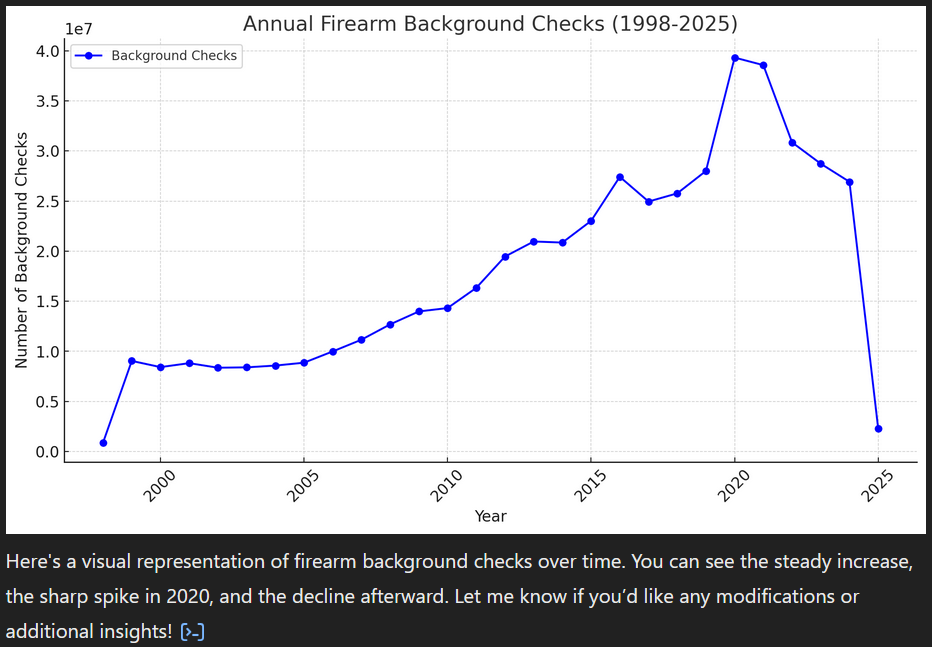

# Gun Registration


## Overview
This repository contains a project focused on gun registration, background checks, and firearm-related data analysis. The project may include data processing scripts, visualization tools, and compliance tracking related to firearm registrations.



## Repository Structure

- **Data Files:**
  - `firearm_deaths.csv`: Contains data on firearm-related deaths.
  - `nics-firearm-background-checks.csv`: Includes records of firearm background checks.
  - `states.csv`: Provides information on U.S. states, possibly for data merging or reference.

- **Malloy Files:**
  - `backgroundsource.malloy`: Defines the data models and relationships for analysis.
  - `guns.malloynb`: A Malloy notebook containing queries and visualizations related to gun data.

- **Supporting Files:**
  - `README.md`: Offers an overview and instructions for the project.
  - `.gitattributes`: Manages repository attributes and settings.
  - `images/`: Directory potentially containing visual assets for documentation or analysis.

## Installation
To get started, clone the repository and install dependencies:

```sh
git clone https://github.com/darrenowsley/gun_registration.git
cd gun_registration
```

If applicable, install required dependencies:

```sh
pip install -r requirements.txt  # For Python projects
yarn install  # For JavaScript projects
```

## Setting Up the Malloy Extension in VS Code
To effectively work with Malloy files (`.malloy` and `.malloynb`), it's recommended to install the Malloy extension in VS Code. Follow these steps:

1. **Install Visual Studio Code:**
   - Download and install VS Code from the [official website](https://code.visualstudio.com/).

2. **Add the Malloy Extension:**
   - Open VS Code.
   - Navigate to the Extensions view by clicking the square icon on the sidebar or pressing `Ctrl+Shift+X`.
   - Search for "Malloy" in the Extensions Marketplace.
   - Locate the [Malloy extension](https://marketplace.visualstudio.com/items?itemName=malloydata.malloy-vscode) and click "Install".

3. **Explore Malloy Features:**
   - With the extension installed, open `.malloy` or `.malloynb` files to access Malloy's data modeling and querying capabilities.
   - Utilize the extension's features to run queries, visualize data, and develop models.

For a visual walkthrough of the installation process and an introduction to using Malloy in VS Code, you might find this tutorial helpful:  
[Malloy VS Code Extension Setup](https://www.youtube.com/watch?v=icinLH7uQjM)

## Usage
Run the application with:

```sh
python main.py  # If applicable
```

For other usage instructions, refer to the project's documentation or source code.

## Contributing
Contributions are welcome! Please follow these steps:
1. Fork the repository
2. Create a new branch (`feature-branch`)
3. Commit your changes
4. Open a pull request

## License
This project is licensed under the [MIT License](LICENSE).

## Contact
For questions or suggestions, contact [Darren Owsley](https://github.com/darrenowsley).
